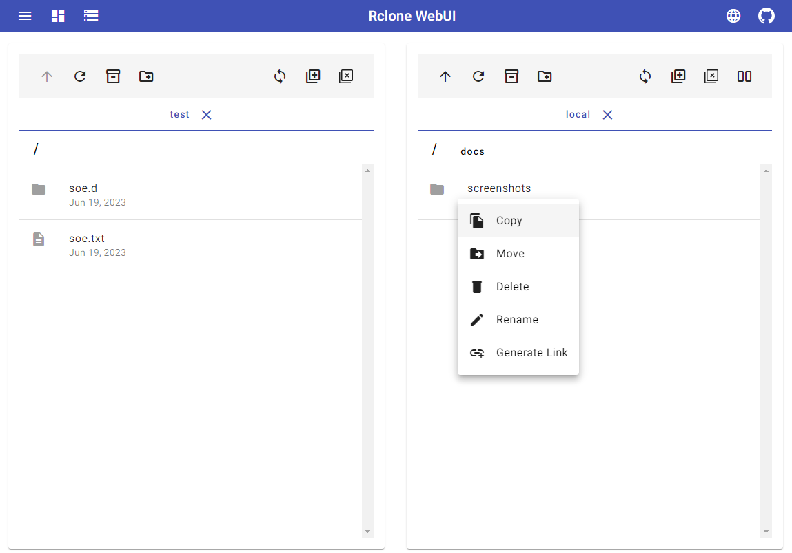

# Rclone-Webui-Angular

This project is another webui for [rclone](https://github.com/rclone/rclone)

WARNING: this project is still in development, please do not use it in production environment

## Use

1. Install [rclone](https://rclone.org/downloads/) if you haven't

1. If you have used [rclone-webui-react](https://github.com/rclone/rclone-webui-react) before, you need to remove the cache

   Windows PowerShell

   ```powershell
   Remove-Item -Recurse $env:LOCALAPPDATA\rclone\webgui
   ```

   Linux

   ```bash
   rm -r ~/.cache/rclone/webgui
   ```

1. Then run the following command

   Windows PowerShell

   ```powershell
   # generate a random password
   $PASSWD = -join ((97..122) | Get-Random -Count 24 | ForEach-Object {[char]$_})
   # start rclone
   rclone rcd --rc-web-gui --rc-user="admin" --rc-pass="${PASSWD}" --rc-web-fetch-url="https://api.github.com/repos/yuudi/rclone-webui-angular/releases/latest"
   ```

   Linux

   ```bash
   # generate a random password
   PASSWD=$(openssl rand -base64 18)
   # start rclone
   rclone rcd --rc-web-gui --rc-user="admin" --rc-pass="${PASSWD}" --rc-web-fetch-url="https://api.github.com/repos/yuudi/rclone-webui-angular/releases/latest"
   ```

1. Then the browser will open automatically, if not, follow the link in the terminal

## Screenshot

backends


create backends


explorer



## Development environment

Run backend: `rclone rcd --rc-user="<your username>" --rc-pass="<your password>" --rc-addr=127.0.0.1:5572`

Run frontend: `ng serve`

Api calling will be proxied to backed [config](./src/proxy.conf.mjs)

## Todo

- [ ] Mounting management
- [ ] Job viewer
- [ ] International workflow
- [ ] More Platforms
  - [ ] Rclone embedded
  - [ ] PWA Standalone
  - [ ] Electron
